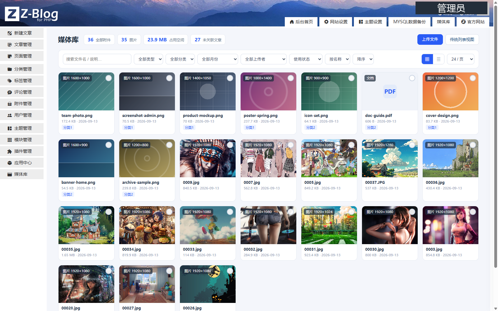
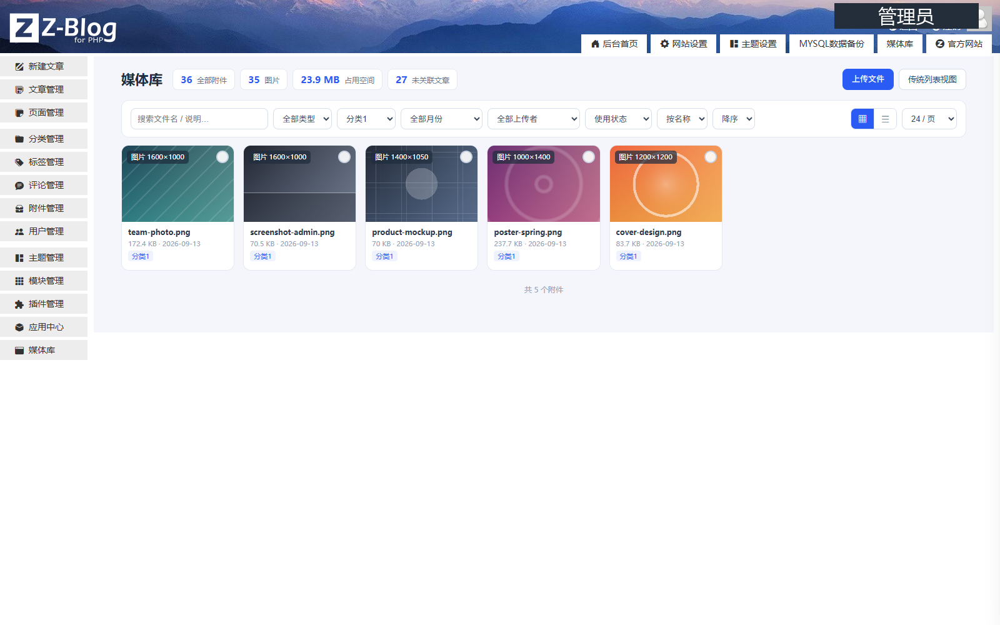
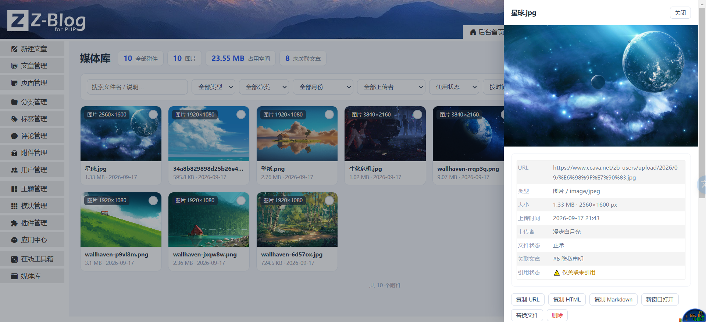

# 媒体库 · 相册式附件管理

以相册（网格）形式集中管理 Z-BlogPHP 的图片与附件，补齐系统默认「附件管理」在筛选、浏览、维护上的不足。

## 功能

1. **相册网格视图 / 列表视图**一键切换，图片直接显示缩略图，其他文件显示类型图标。
2. **按文章分类筛选**：附件通过所属文章自动关联到分类，支持含子分类，侧栏显示各分类附件数量。
3. **多维筛选**：文件类型（图片 / 视频 / 音频 / 文档 / 压缩包 / 其他）、上传月份、上传者、关联文章、是否已关联文章。
4. **关键词搜索**：文件名、原始文件名、说明。
5. **拖拽或多选上传**，实时进度条；上传时可指定关联文章。
6. **替换文件**：保留原有附件记录与 URL 不变，只换内容。
7. **详情侧栏**：大图预览、图片尺寸、文件大小、上传者、文件是否存在；一键复制 URL / HTML / Markdown 代码。
8. **编辑信息**：标题、说明、图片 Alt（保存在附件自定义域，不改动系统数据表结构）。
9. **批量操作**：全选本页、批量删除、批量关联到指定文章。
10. **灯箱大图浏览**，支持键盘左右切换与 Esc 关闭。
11. **统计概览**：附件总数、图片数、占用空间、未关联文章数。

## 截图

| 相册网格总览 | 按文章分类筛选 |
|---|---|
|  |  |

## 安装

1. 后台「应用中心」上传 `media_library.zba`，或在插件管理中启用本插件；
2. 启用后，后台左侧菜单出现「媒体库」，系统「附件管理」页面右上角也会出现「相册视图」入口。

## 使用

- **浏览**：进入「媒体库」即可看到全部附件，默认按上传时间倒序。右上角可切换网格 / 列表视图，可调整每页数量与排序方式。
- **筛选**：左侧筛选栏选择文件类型、文章分类、上传月份、上传者，或直接搜索关键词；多个条件同时生效。
- **上传**：点击「上传文件」选择文件，也可以直接把文件拖到页面中；上传前可指定要关联的文章。
- **编辑**：点击任意附件打开右侧详情，修改标题、说明、Alt，或重新关联到其它文章。
- **替换**：在详情中点击「替换文件」，选择新文件即可，附件地址保持不变。
- **删除**：勾选附件后使用批量删除，或在详情中删除单个附件（会同时删除磁盘文件）。

## 兼容性

- 适用于 Z-BlogPHP 1.7.0 及以上版本。
- 支持 MySQL、SQLite、PostgreSQL 三种数据库。
- 数据查询全部使用系统自带的 SQL 构造器，不直接拼接 SQL 语句，不创建数据表，不修改系统文件。

## 卸载

卸载插件不会删除任何已上传的附件文件与数据库记录。

## 更新日志

### 1.1.3

- 安全加固：上传白名单默认不再包含 SVG / SVGZ / XML / HTML 等可内嵌脚本的格式，避免存储型 XSS（如站点确实需要 SVG，可在「网站设置→全局设置」中自行放开系统上传白名单，本插件将跟随系统设置，需自行承担风险）。
- 安全加固：替换文件时强制校验新文件扩展名与原附件路径的归属关系，杜绝路径穿越写入。
- 安全加固：文件名净化规则加强（剥离控制字符与路径分隔符），上传、替换、批量操作统一走白名单校验。
- 安全加固：接口统一要求登录 + 管理员权限 + CSRF 令牌，匿名访问一律 401；未授权删除等敏感操作二次确认权限。
- 响应头补充 `X-Content-Type-Options: nosniff`，JSON 输出前清理缓冲区。

### 1.1.2

- 修复按文章分类筛选时报错的问题（改为读取系统分类表构建分类层级，兼容各版本）。
- 上传等写操作的安全校验完善，校验失败时返回明确提示。
- 后台请求出现异常时，界面直接显示服务端返回的错误原因，便于排查。

### 1.1.1

- 修复上传文件失败的问题。
- 修正写操作接口的参数读取方式。

### 1.1.0

- 数据查询改为使用系统自带 SQL 构造器与对象接口，符合应用中心上架规范。
- 修复写操作接口参数读取问题（上传 / 替换 / 编辑 / 删除 / 批量）。
- 统计与列表合并为单次扫描，减少数据库查询次数。
- 附件量超过 3 万时自动跳过分布统计，避免后台变慢。

### 1.0.2

- 修复公共函数文件重复载入导致的错误。
- 修正作者信息。

### 1.0.1

- 修复「附件管理」页面子菜单接口兼容性问题。

### 1.0.0

- 首个版本。

## 作者

漫步白月光 · https://www.at8.fun/ · 361611074@qq.com
