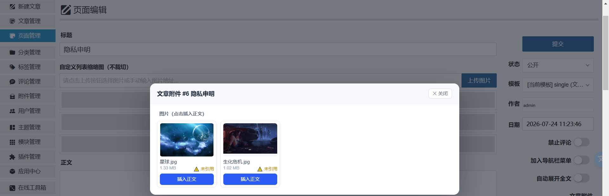

# 媒体库 · 相册式附件管理

以相册（网格）形式集中管理 Z-BlogPHP 的图片与附件，补齐系统默认「附件管理」在筛选、浏览、维护上的不足。

**at8_media_library 是 Z-BlogPHP 官方附件系统之上的高级媒体库管理界面。**

> **定位**
>
> - **本插件（媒体库）负责**：查询、筛选、搜索、排序、分页、预览、统计、文章关联，以及批量管理 UI、JSON 接口包装、权限边界与 CSRF。
> - **Z-BlogPHP 官方附件系统负责**：上传、文件类型与大小校验、文件保存、文件命名、附件记录、附件删除、实际存储删除、云存储 Hook、附件计数与官方生命周期 Hook。
>
> 插件不重复实现、不替代、不绕过官方附件能力；官方未提供稳定可复用能力的功能（如附件替换），本插件选择不提供，而不是自行实现一套。

## 功能

1. **相册网格视图 / 列表视图**一键切换，图片直接显示缩略图，其他文件显示类型图标。
2. **按文章分类筛选**：附件通过所属文章自动关联到分类，支持含子分类，侧栏显示各分类附件数量。
3. **多维筛选**：文件类型（图片 / 视频 / 音频 / 文档 / 压缩包 / 其他）、上传月份、上传者、关联文章、是否已关联文章。
4. **关键词搜索**：文件名、原始文件名、说明。
5. **拖拽或多选上传**，实时进度条；上传时可指定关联文章。可上传类型与单文件大小上限跟随站点「网站设置 → 允许上传的文件类型 / 大小」。
6. **详情侧栏**：大图预览、图片尺寸、文件大小、上传者、文件状态；一键复制 URL / HTML / Markdown 代码。
7. **编辑信息**：标题、说明、图片 Alt（保存在附件自定义域，不改动系统数据表结构）。
8. **批量操作**：全选本页、批量删除、批量关联到指定文章。
9. **灯箱大图浏览**，支持键盘左右切换与 Esc 关闭。
10. **统计概览**：附件总数、图片数、占用空间、未关联文章数。

## 架构与合规

本插件**不是**一套独立的附件系统，而是 Z-BlogPHP 官方附件系统之上的管理界面。附件生命周期完全由官方负责：

| 操作 | 插件做的事 | 实际执行的官方能力 |
|---|---|---|
| 上传 | 权限 / CSRF / 参数校验 → 调用官方上传能力 | `PostUpload()`（`zb_system/function/c_system_event.php`） |
| 删除 | 权限 / CSRF / 数据范围校验 → 调用官方删除能力 | `DelUpload()`（`zb_system/function/c_system_event.php`） |
| 编辑信息 | 只写自有展示字段与 `LogID` 关联 | `Upload::Save()`（`zb_system/function/lib/base/upload.php`） |
| 查询 / 筛选 / 统计 | 插件自有 | 官方 `Upload` 表 + 官方 SQL 构造器 |

官方 `PostUpload()` / `DelUpload()` 内部完成的事情，插件**一律不重复实现**：

- 文件类型安全（`Upload::CheckExtName()`，读取站点「允许上传的文件类型」，并硬拒绝 `php` / `phtml` / `phar` / `.htaccess` / `web.config`）；
- 文件体积安全（`Upload::CheckSize()`，读取站点「允许上传的大小」）；
- 同名文件规则（官方同月重名判定）；
- 文件落盘与存储路径规则（`Upload::SaveFile()`，含 `Filter_Plugin_Upload_SaveFile` 云存储 Hook）；
- 附件记录写入（`Upload::Save()`）与官方对象缓存（`$zbp->AddCache()`）；
- 用户附件计数（`CountMemberArray()`）；
- 官方上传成功 Hook（`Filter_Plugin_PostUpload_Succeed`）；
- 附件删除与云存储删除 Hook（`Upload::DelFile()` + `Filter_Plugin_Upload_DelFile`）。

插件**不**修改 `zb_system/` 下任何核心文件，不覆盖官方 `Upload` 类，不替换 `cmd.php`，不拦截、不替代、不复制、不绕过任何系统预留接口。

插件负责的边界只有：登录校验、CSRF 校验、权限校验（`UploadPst` / `UploadDel` / `UploadAll`）、数据范围限制（与官方附件管理一致）、参数格式校验、UI 输出转义。

## 界面预览

| 相册网格总览 | 按文章分类筛选 |
| --- | --- |
|  |  |
| **附件详情与引用状态检测** | **文章编辑页「文章附件」面板** |
|  |  |

> 截图仅用于文档展示，`zbignore.txt` 已将其排除在 zba 安装包之外。

## 安装

1. 后台「应用中心」上传 `at8_media_library.zba`，或在插件管理中启用本插件；
2. 启用后，后台左侧菜单出现「媒体库」，系统「附件管理」页面右上角也会出现「相册视图」入口。

## 使用

- **浏览**：进入「媒体库」即可看到全部附件，默认按上传时间倒序。右上角可切换网格 / 列表视图，可调整每页数量与排序方式。
- **筛选**：左侧筛选栏选择文件类型、文章分类、上传月份、上传者，或直接搜索关键词；多个条件同时生效。
- **上传**：点击「上传文件」选择文件，也可以直接把文件拖到页面中；上传前可指定要关联的文章。可上传类型、单文件大小上限、同名文件规则均以站点「网站设置」与官方附件系统为准。
- **编辑**：点击任意附件打开右侧详情，修改标题、说明、Alt，或重新关联到其它文章。
- **删除**：勾选附件后使用批量删除，或在详情中删除单个附件（由官方附件系统删除文件与记录）。

## 兼容性

- 适用于 Z-BlogPHP 1.7.0 及以上版本。
- 需要 PHP 7.4 及以上（`plugin.xml` 声明 `<phpver>7.4</phpver>`，应用中心据此拒绝安装）。全量文件在 7.3.4 通过语法校验、运行时在 PHP 8.2 / 8.3 实测零报错，且未使用任何 PHP 8.0+ 专有语法。
- 支持 MySQL、SQLite、PostgreSQL 三种数据库。
- 数据查询全部使用系统自带的 SQL 构造器，不直接拼接 SQL 语句，不创建数据表，不修改系统文件。

## 卸载

卸载插件不会删除任何已上传的附件文件与数据库记录。

## 开发者接口（v1.5.0 起；1.7.1 对外提供 5 个 Filter 接口）

本插件对外暴露 5 个 Filter 接口，**全部只用于展示与查询**。其他插件 / 主题在 `ActivePlugin_应用ID()` 中用官方 `Add_Filter_Plugin()` 挂载即可。`$arg` 声明 `&` 可修改，`$context` 为只读上下文、可不接收。

| 接口名 | 回调签名 | 说明 |
|---|---|---|
| `Filter_Plugin_at8_media_library_ListWhere` | `(&$where, $p)` | 列表查询条件过滤（追加自定义筛选维度） |
| `Filter_Plugin_at8_media_library_Thumb` | `(&$url, $upload)` | 缩略图地址接管（云存储 / CDN / 缩略图插件） |
| `Filter_Plugin_at8_media_library_Row` | `(&$row, $upload)` | 附件行数据输出前过滤（追加自定义字段 / 徽标） |
| `Filter_Plugin_at8_media_library_Stats` | `(&$stats)` | 统计口径过滤（覆盖缓存与重算全部返回路径） |
| `Filter_Plugin_at8_media_library_EditPanel` | `(&$html)` | 编辑页「文章附件」面板 HTML 过滤 |

> **安全边界**：接口基于官方 `DefinePluginFilter()` 声明机制，其他插件经 `Add_Filter_Plugin()` 挂载。这些接口都只能影响**展示与查询结果**，无法影响附件的写入 / 删除路径，也不存在「绕过官方上传白名单」的通路。

### v1.7.0 起移除的接口

| 原接口 | 移除原因 | 替代方案 |
|---|---|---|
| `Filter_Plugin_at8_media_library_AllowExts` | 会成为「绕过官方上传白名单」的第二个判断入口 | 上传类型请通过后台「网站设置 → 允许上传的文件类型」调整，由官方 `Upload::CheckExtName()` 统一裁决 |
| `Filter_Plugin_at8_media_library_UploadSucceed` | 与官方上传成功 Hook 重复 | 使用官方 `Filter_Plugin_PostUpload_Succeed`（由官方 `PostUpload()` 触发，媒体库上传同样会走到） |
| `Filter_Plugin_at8_media_library_DeleteSucceed` | 官方附件系统未提供删除成功 Hook，插件不再自造一个涉及附件敏感业务的接口 | 如确需感知删除，请挂官方 `Filter_Plugin_Upload_Del`（删除记录前触发） |

示例：接管缩略图地址

```php
RegisterPlugin("myapp", "ActivePlugin_myapp");
function ActivePlugin_myapp() {
  Add_Filter_Plugin('Filter_Plugin_at8_media_library_Thumb', 'myapp_Thumb');
}
function myapp_Thumb(&$url, $upload) {
  if (in_array(pathinfo($upload->Name, PATHINFO_EXTENSION), array('jpg', 'png'))) {
    $url = 'https://cdn.example.com/thumb/' . rawurlencode(basename($upload->Name));
  }
}
```

## 更新日志

### 1.7.1（2026-09-25）

官方市场审核前最终架构收尾（无新增功能，不改动附件处理架构）：

- 完成官方市场审核前最终架构收尾：附件敏感操作全部由 Z-BlogPHP 官方附件体系承担，媒体库继续聚焦查询、筛选、预览、统计与管理体验；
- 清理残留：API 白名单、README、发布清单中不再出现任何「替换文件 / `replace` 动作」的现存表述（该功能已于 1.7.0 移除。官方附件系统未提供稳定、可复用、适合第三方插件调用的替换 API，故本插件不提供该功能，也不自行实现一套替换引擎）；
- 统一 API、前端、README、CHANGELOG、发布清单与版本号；
- 前端 `script/app.js` 中「取消关联」按钮的 DOM id 与变量名由 `*-unlink*` 改为 `*-unbind*`，避免与「删除文件」语义混淆（该按钮只解除附件与文章的关联，不涉及任何文件操作）；
- `$_FILES` / `$_GET` 的官方调用适配改为 `try / finally` 结构：无论官方流程正常返回、抛 `ZbpErrorException` 还是任何 `Throwable`，都会在 `finally` 中完整还原全局变量，不污染同请求内的其他插件；
- 统一 API 失败响应状态码：`at8_media_library_error()` 默认按「请求参数错误」返回 `400`，未选择附件 / 超批量上限 / 关联文章不存在 / 无文件 / 超上传数量等参数校验失败不再返回 `200 OK`（响应体结构 `{success, code, msg}` 不变，前端零改动）；
- 修正发布清单中 `<adapted>` 的语义描述：官方口径为 `MAJOR.MINOR.COMMIT`（`c_system_version.php` 的 `$GLOBALS['blogversion']`），`172900` = 1.7 线 commit 2900，等价于「最低 Z-BlogPHP 1.7.0」；
- 降低与官方核心及第三方存储扩展的长期维护成本。

### 1.7.0（2026-09-25）

**市场合规架构重构**——把插件从「自行实现附件上传 / 替换 / 删除底层业务」改造成「媒体库 UI + Z-BlogPHP 官方附件系统适配层」。

- 重构附件写操作架构，对齐 Z-BlogPHP 官方附件处理流程：上传改走官方 `PostUpload()`，删除改走官方 `DelUpload()`，编辑信息走官方 `Upload::Save()`；
- 移除插件自行维护的附件底层安全 / 存储逻辑：不再自建上传白名单、不再自算文件命名、不再自测 MIME 与图片内容、不再自读 `php.ini` 判定体积、不再自行落盘、不再自行 `unlink` 附件文件、不再自行同步用户附件计数；
- 上传的类型 / 体积 / 同名规则全部改由官方 `Upload::CheckExtName()` / `CheckSize()` 与官方同月重名判定裁决，插件不再拥有第二个安全判断入口；
- 删除「替换文件」功能：Z-BlogPHP 官方附件系统未提供可复用的附件替换能力，为不自行维护一套「文件替换引擎」与伪原子事务，本版本移除该功能（如需换图请删除后重新上传）；
- 移除 `Filter_Plugin_at8_media_library_AllowExts` / `UploadSucceed` / `DeleteSucceed` 三个涉及附件敏感业务的对外接口，保留 `ListWhere` / `Thumb` / `Row` / `Stats` / `EditPanel` 五个展示与查询接口；
- 缓存 Key 补站点环境前缀：同一服务器多站点共用 Redis / APCu 时不再互相命中；
- 保留媒体库查询、筛选、搜索、预览、灯箱、统计、文章关联等核心功能；
- 降低与第三方存储插件及未来 Z-BlogPHP 更新之间的兼容维护成本。

> 升级说明：1.6.6 → 1.7.0 可直接覆盖升级，插件配置、已有附件记录与附件文件全部保留；升级后附件写操作即进入新架构，不再回落到旧上传引擎。

### 1.6.6（2026-09-24）

修复 debug 模式下的一条 PHP 警告（无功能变更）：

- 修复 `at8_media_library_cache_del()` 未判存在即删除导致的 `E_WARNING`（`unlink(...): No such file or directory`）。该函数原先直接 `@unlink()` 缓存文件，而 Z-BlogPHP 的错误处理器不理会 `@` 抑制；缓存文件本就不存在时（`stats_flush()` 每次写操作都会清 3 个统计缓存键）就会向错误日志落一条警告。现改为先 `is_file()` 判断再删；
- 同步更新 `function.php` 版本常量、`plugin.xml`、`CHANGELOG.md` 与发布检查清单。

### 1.6.5（2026-09-24）

规范符合性微调（无功能变更）：

- **元数据补齐**：`plugin.xml` 的 `<source>` 节点补 `<email>361611074@qq.com</email>`（与 `<author>` 一致，便于应用中心审核员核对作者信息）；`<modified>` 同步至 2026-09-24；
- `zbignore.txt` 调整：`README.md` 不再排除（上架审核对使用说明有要求，README 进 zba 包便于审核员查阅）；`CHANGELOG.md` / `RELEASE_CHECKLIST.md` / `screenshots` / `cache` / `.git` 仍按原状排除；
- 同步更新 `function.php` 版本常量、`plugin.xml` 元数据、`CHANGELOG.md` 与发布检查清单。

### 1.6.4（2026-09-23）

- **最低 PHP 版本提高至 7.4**（`plugin.xml` 的 `<phpver>`，应用中心安装门槛）。依据：全量文件在 PHP 7.3.4 通过 `php -l`（严于 7.4）、运行时在 PHP 8.2 实测零报错、源码未使用任何 PHP 8.0+ 专有语法（已扫描确认无 `?->` / `match` 表达式 / `str_contains` / `#[Attribute]` / 构造器提升 / 联合类型 / `enum` / `readonly`）；
- 同步更新 README「兼容性」中的 PHP 版本表述。

### 1.6.3

- 规范：失败响应的 HTTP 状态码与 JSON `code` 对齐（`code` 在 400~599 时同步设置 HTTP 状态码），参数校验失败 / 未授权 / 方法不允许不再一律返回 `200 OK`；响应体结构不变，前端零改动

### 1.6.2

- 安全：写操作（`upload` / `update` / `bulk` / `delete`；1.7.0 前另含 `replace`，该动作已随「替换文件」功能一并移除）强制 POST，非 POST 返回 `405`
- 安全：`act` 不再读 `$_REQUEST`（含 COOKIE），改为显式「POST 优先 → GET 兜底」，并按只读 / 写操作两张白名单分发，未列出一律 `400`；未知动作不再回显原始输入
- 安全：CSRF 校验非 POST 不再静默跳过，改为直接拒绝（防新增调用点漏校验）
- 规范：JSON 响应新增 `success` 布尔字段（`{success, code, msg, data}`），`code` / `msg` 保持不变，前端零改动
- 规范：JS 全局命名空间 `window.ML` → `window.AT8ML`，对齐插件唯一前缀
- 规范：核实 1.7.5 停用流程后会触发卸载钩子，`UninstallPlugin_*` 仅清理可再生缓存目录，不再触碰配置与附件数据
- 物料：新增 `LICENSE` / `CHANGELOG.md` / `RELEASE_CHECKLIST.md`；`plugin.xml` 声明 `<phpver>7.0</phpver>`

### 1.6.1

- 安全：修复关联越权——`upload` / `update` / `bulk bind` 的 `logid` 新增服务端校验（`at8_media_library_validate_logid`）：文章必须存在且属于自己（或拥有 `UploadAll`），防止通过「关联附件 + 引用检测 / 关联标题回显」探测他人草稿、审核中文章的标题与正文特征
- 加固：替换附件在 `DelFile()` 与 `SaveFile()` 之间对原文件做临时备份，任一步失败自动恢复原文件并保留记录，杜绝「记录在、文件丢」

### 1.6.0

- 安全：对齐官方附件管理的数据范围——无 `UploadAll` 权限的用户在列表、统计、筛选、引用检测、编辑页面板中仅能看到自己的附件，服务端强制注入查询条件，不信任前端参数（对齐官方 `Admin_UploadMng` 的 `ul_AuthorID` 过滤）
- 安全：写操作权限细分对齐官方 `PostUpload` / `DelUpload`——上传/替换/编辑/关联使用 `UploadPst`，删除使用 `UploadDel`，`UploadAll` 仅用于操作其他用户的附件；无权限时他人附件在批量操作中计为跳过并返回成功/失败/跳过计数
- 兼容：文件存在性判定不再依赖本地文件——系统标准记录一律视为可访问（URL 由系统 / 云存储 hook 提供），本地无文件仅显示「可能已转存云端」中性提示，不再误报「文件缺失」；图片、视频、音频预览直接使用官方附件 URL，对象存储（如 fui_oss 删除本地文件后）附件可正常显示与预览
- 兼容：上传落盘校验放宽——`Filter_Plugin_Upload_SaveFile` 被存储插件接管时本地未落盘属预期行为，大小 / MIME 改从临时文件读取，兼容完全不保存本地文件的存储插件
- 兼容：替换附件改走官方存储流程——先 `DelFile()`（触发云存储删除 hook）再 `SaveFile()`（触发云存储上传 hook），保证对象存储与数据库同步更新；旧格式记录维持本地直替
- 规范：上传成功后经官方 `CountMemberArray()` 同步用户附件数并触发官方 `Filter_Plugin_PostUpload_Succeed` hook；删除成功后同步 `CountMemberArray(-1)`；删除文件失败时保留数据库记录并返回失败，不再出现「记录已删文件还在」
- 规范：`plugin.xml` 的 `<adapted>` 改为 Z-BlogPHP 内部版本号（172900 = 1.7.0），`dependency` / `rewritefunctions` / `existsfunctions` / `conflict` 移入 `<advanced>` 节点

### 1.5.1

- 规范：新增 `UpdatePlugin_at8_media_library()` 更新钩子（含旧版兼容别名 `at8_media_library_Updated()`），引入 `ConfigVer` 配置版本迁移机制，后续版本新增/变更配置键在此逐级迁移（对齐官方「启用/停止/更新插件时执行」规范）
- 规范：后台管理页移除 4 处内联 `style="display:none"`（批量条 / 空态 / 加载态 / 文件选择框），初始隐藏改由 `style.css` 统一控制，JS 内联样式切换逻辑不受影响

### 1.5.0

- 新增：对外暴露 Filter 接口（`AllowExts` / `ListWhere` / `Thumb` / `Row` / `Stats` / `UploadSucceed` / `DeleteSucceed` / `EditPanel`），其他插件经官方 `Add_Filter_Plugin()` 挂载即可扩展本插件行为，详见「开发者接口」章节（**当前对外提供 5 个展示与查询接口**；其中 `AllowExts` / `UploadSucceed` / `DeleteSucceed` 已于 1.7.0 移除）
- 新增：编辑页面板输出经接口过滤后再渲染（内容经输出缓冲捕获，不影响原有结构）

### 1.4.2

- 修复：`check_csrf()` 直接读取 `$zbp->option['ZC_ADDITIONAL_SECURITY']` 未做存在性判断——部分站点 / 历史版本缺少该 option 时，debug（开发模式）下会抛 `Undefined array key` 并被渲染成错误页；现改为 `isset()` 守卫后取值
- 优化：批量关联文章（bulk bind）由逐条 `GetUploadByID()` 改为一次 `IN` 查询取回全部附件对象，消除最多 500 次的 N+1 查询
- 优化：附件磁盘路径解析 `disk_path()` 增加请求内静态缓存，列表渲染每行不再重复 `realpath()` / `is_file()` 系统调用
- 规范：审计日志标签由 `[media_library]` 对齐为 `[at8_media_library]`，与插件 ID 一致便于检索
- 规范：`plugin.xml` 的 `<modified>` 随版本同步更新

### 1.4.1

- 修复：文件缓存载荷由 `var_export` 改为 `base64(JSON)`——原 `?>` 防护替换为无效操作（替换前后字符相同），当分类名 / 作者名等进入缓存的数据含 PHP 结束标记时，缓存文件会被提前截断且持续损坏。base64 字符集不含标记字符，天然免疫；经含特殊字符数据的写读往返实测验证
- 修复：进入媒体库后左侧菜单高亮失效——`ActiveLeftMenu()` 传入的菜单 id（`nav_media_library`）与注册的 `nav_at8_media_library` 不一致
- 修复：菜单入口权限与实际访问权限不一致——左菜单 / 顶菜单原要求 `root` 级别，与 `can_view()` 允许的 `UploadMng` 不符，多作者站点上有附件管理权限的账号看不到入口；现统一为 `UploadMng`
- 加固：上传文件名防双扩展名——主名任一段落为可执行脚本扩展名（`php*` / `phtml` / `phar` / `pht`）时拒绝（如 `shell.php.jpg`）
- 修复：老附件记录 `SourceName` 为空时列表显示空名，回退显示磁盘文件名
- 优化：卸载清理补齐 dotfile（原 `glob('*')` 不匹配 `.htaccess` 等隐藏文件）

### 1.4.0

- 规范：自定义函数 / 常量前缀与应用 ID 统一——`media_library_*`（58 个函数）更名为 `at8_media_library_*`，`MEDIA_LIBRARY_VERSION` 更名为 `AT8_MEDIA_LIBRARY_VERSION`（对齐《注意事项速查表》03 条）
- 规范：`script/app.js` 与编辑页脚本全部放弃 `var`，改用 `let` / `const`（速查表 18 条）
- 规范：编辑页面板内联 `<style id="ml-edit-style">` 与约 150 行内嵌 `<script>` 外置为 `css/edit.css` 与 `script/edit.js`（CSRF 令牌经 `data-token` 属性注入）；JS 动态渲染的内联 `style=""` 收敛为 class（速查表 17 条）
- 优化：`realpath_in_upload()` 前缀判断补目录分隔符，防 `/upload2` 类相邻目录误判
- 优化：卸载插件时清理插件目录下运行时生成的 `cache/` 文件缓存
- 优化：API 未知操作提示不再做 HTML 转义，消除前端展示的双重转义实体字符（`$act` 不参与任何 SQL / 文件操作）
- 优化：图片尺寸 `getimagesize()` 增加请求内静态缓存（key 含文件 mtime），同一附件同请求内不重复读盘

### 1.3.2

- 修复：debug 插件（开发模式）下所有 API 响应被系统错误页 HTML 污染导致媒体库不可用——JSON 输出前的缓冲清理原为「清空全部缓冲层」循环，会把 debug 插件的输出捕获层一并删除，其收尾 `ob_end_clean()` 时无缓冲可删产生 E_WARNING，被 debug 模式错误处理器渲染为整页 HTML 追加在 JSON 之后。现对齐官方 `ApiResponse()` 的 `@ob_clean()` 思路：只清空缓冲内容、不删除任何缓冲层，输出 JSON 后逐层推送给客户端（缓冲层保留且已空），debug 插件收尾不再告警、JSON 也不会被其收尾清理连带丢弃

### 1.3.1

- 安全修复：文章搜索接口（关联下拉）增加状态过滤——非管理员仅可见「已发布 + 自己的」文章/页面，防止他人草稿、审核中、私人文章标题被枚举
- 安全加固：上传硬拒绝扩展名补充 `.ini`（防 `.user.ini` 落盘利用）与 `.env`
- 安全加固：单次上传文件数上限 30 个，防止资源滥用
- 加固：编辑页面板插入正文时对 URL / Alt 二次转义，历史附件文件名含引号时不再破坏 HTML 属性边界
- 优化：批量关联操作补审计日志（与删除/替换一致）

### 1.3.0

- 修复：媒体库页面打开报「Undefined array key 0」——v1.2.9 改用官方 `GetPostList()` 时误用其签名（官方第一参数是 `$select` 而非 `$where`），修正为 `GetPostList(null, $where, $order, $limit)`
- 说明：版本号规则调整为十进制进位（每位 0~9，封十进一），原 1.2.10 更名发布为 1.3.0

### 1.2.9

- 重构：上传落盘改用系统官方 `Upload::SaveFile()`——由系统负责建目录与 Windows 字符集转码，并触发 `Filter_Plugin_Upload_SaveFile` 接口（云存储接管类插件经此生效），不再自写 mkdir / move_uploaded_file 流程
- 重构：分类相关查询改用系统常驻的 `$zbp->categories` 对象（分类映射、子分类递归、分类树三处），去掉直查 category 表的重复实现
- 优化：文章搜索（关联下拉）改用官方 `$zbp->GetPostList()`
- 优化：CSRF 校验优先复用官方 `CheckCSRFTokenValid()`
- 修复：插件配置 `perpage` 已定义但从未读取——后台管理页现在读取该配置作为默认每页数量（含下拉默认选中）
- 清理：移除从未使用的 `version` 配置写入

### 1.2.8

- 优化：编辑页「文章配图」面板升级为「文章附件」——支持全部附件类型，图片点击插入正文，视频/音频/文档/压缩包等其他附件点击插入下载链接（`<a href>`），并显示类型图标与引用状态
- 修复：类别筛选与统计口径不一致——.svg 文件在 MIME 缺失时图片筛选/统计漏算

### 1.2.7

- 优化：「文章配图」面板按钮靠右对齐，与右侧栏标题/开关布局对齐

### 1.2.6

- 精简：编辑页「文章配图」面板移除「上传图片」按钮，仅保留「管理 / 插入配图」（上传走编辑器自带功能即可）

### 1.2.5

- 修复：编辑页「文章配图」弹窗仍被编辑器工具条/页面内容压住的层叠问题——打开弹窗时将遮罩挂载到 body 顶层（脱离右栏层叠上下文），z-index 拉满（2147483000），并在弹窗打开期间隐藏编辑器工具条（关闭后恢复），三重保证弹窗永远在最上层

### 1.2.4

- 修复：文章编辑页「文章配图」弹窗错乱——弹窗样式改为独立作用域（ID 选择器 + 显式四边定位 + 高 z-index 遮罩），不再依赖后台环境与共享样式表，任何编辑器/后台主题下均正确居中遮罩显示；支持 Esc 关闭
- 优化：「文章配图」面板按钮美化——「管理 / 插入配图」蓝色主按钮、「上传图片」次级按钮，均带左侧图标，替换后台默认小灰按钮
- 优化：列表视图勾选框由 16px 进一步缩小为 12px，选中对勾按比例缩放
- 修复：详情抽屉「引用状态」——未关联文章的附件原显示「—（未关联）」，改为「⚠️ 未引用（未关联文章）」，语义与「未引用」一致；引用检测失败不再卡在「检测中…」，显示重试提示
- 性能：汇总统计缓存升级为多级缓存——自动探测 Redis（ext/redis，默认 127.0.0.1:6379，可用插件配置 redis_host/redis_port/redis_auth 覆盖）、APCu、Opcache 文件缓存（PHP 数组 + include，opcache 开启时读取走共享内存），任一组件存在即自动启用并逐级降级；多管理员并发访问共享同一份缓存

### 1.2.3

- 新增：详情抽屉「引用状态」——关联文章的正文中是否实际引用了该附件（✅ 已在正文引用 / ⚠️ 仅关联未引用 / 关联文章不存在），消除「关联了却没用、用了却没关联」的账实不符
- 新增：文章/页面编辑页右栏「文章配图」面板——弹窗列出本文关联的图片（含引用状态），一键插入编辑器正文（经 `editor_api` 官方接口，兼容全部编辑器）；支持多图上传并自动关联本文、上传后即插入
- 按文章筛选列表时，每行附带引用状态字段（正文单次查询，无 N+1）

### 1.2.2

- 修复：编辑保存（修改关联文章）与批量关联后，顶部「未关联文章」统计未同步刷新（统计缓存未失效，最长 5 分钟内与列表筛选结果矛盾）
- 优化：列表视图勾选框由 20px 缩小为 16px，与行高更协调

### 1.2.1

- 修复：替换文件时错误更新 PostTime（v1.1.5 未实际修复的遗留问题）——PostTime 变化会连带 Dir/Url 变化，导致已发布文章中的附件链接 404、跨月替换后文件显示缺失
- 修复：批量关联弹窗快速双击会叠出重复弹窗
- 修复：批量删除分批请求中单批失败不再中断后续批次，结束后汇总提示（含失败数）
- 修复：编辑保存后若处于「使用状态 / 未关联附件」筛选，列表按筛选结果重新加载
- 优化：视频缩略图移除多余的空 src img 元素

### 1.2.0

- 应用 ID 与目录更名为 `at8_media_library`（原 `media_library`），统一 at8_ 前缀，避免与其他插件冲突；升级后需在插件管理中重新启用，配置自动迁移。
- 编辑抽屉新增「取消关联」按钮：已关联文章的附件可解除关联（此前只能改关到别的文章）。
- 分类筛选新增「未关联附件」虚拟分类：未关联文章的附件此前只能靠「使用状态」筛选，从分类视角无法触及。
- 批量删除可靠性修复：前端改为每批 20 个分批请求（避免单次删除过多触发 PHP 执行超时）；后端改单次 IN 查询取回附件对象（消除逐条 N+1）；修复批量分支残留旧版路径函数调用导致只删记录不删文件的问题；前端不再把服务端超时等错误误报为「登录已失效」。

### 1.1.5

- 附件存储对齐系统标准格式：`ul_Name` 仅保存文件名，落盘与目录推导交由系统 `Upload` 类（`Dir` 按上传时间推导），彻底修复此前「文件缺失」类问题的根因。
- 附件 URL 与磁盘路径优先使用系统 `Upload` 对象属性（`$u->Url` / `$u->FullFile`）：URL 内置 `rawurlencode`（修复中文 / 空格文件名坏链），并自动兼容云存储接管类插件；旧版带前缀的历史记录保留兼容分支直达，不再逐层探测目录。
- 删除附件改走系统 `DelFile()`（兼容云存储 hook），历史格式记录按兼容路径删除。
- 安全加固：恢复替换文件时的扩展名一致性校验（替换不改变附件地址，类型必须与原附件一致，防止 .jpg 记录被换成其他类型内容）。
- 修复：替换附件不再更新 `PostTime`（避免目录推导变化导致文件指向错位、URL 变化）。
- 修复：上传 / 删除操作后统计下拉重建时会重置用户已选筛选条件的问题，现回填当前选中值。
- 统计缓存改用 JSON 存储，消除 `unserialize` 的对象注入面。

### 1.1.4

- 上传类型跟随站点「允许上传的文件类型」设置：zba、apk、iso 等站点允许的类型均可直接上传（服务端可执行脚本与 svg 等可内嵌脚本格式仍默认排除）。
- 修复系统自带附件管理上传的文件在媒体库中显示「文件缺失」的问题（兼容多种附件路径存储格式，自动探测磁盘位置）。
- 修复此类附件无法替换 / 删除报「路径异常」的问题；文件已不存在的记录可直接删除。
- 附件 URL 按存储格式自动补全，缩略图与访问链接统一。
- 汇总统计数据增加 5 分钟缓存，上传 / 替换 / 删除操作后自动刷新，减少大附件量站点的后台查询开销。

### 1.1.3

- 安全加固：上传白名单默认不再包含 SVG / SVGZ / XML / HTML 等可内嵌脚本的格式，避免存储型 XSS（如站点确实需要 SVG，可在「网站设置→全局设置」中自行放开系统上传白名单，本插件将跟随系统设置，需自行承担风险）。
- 安全加固：替换文件时强制校验新文件扩展名与原附件路径的归属关系，杜绝路径穿越写入。
- 安全加固：文件名净化规则加强（剥离控制字符与路径分隔符），上传、替换、批量操作统一走白名单校验。
- 安全加固：接口统一要求登录 + 管理员权限 + CSRF 令牌，匿名访问一律 401；未授权删除等敏感操作二次确认权限。
- 响应头补充 `X-Content-Type-Options: nosniff`，JSON 输出前清理缓冲区。

### 1.1.2

- 修复按文章分类筛选时报错的问题（改为读取系统分类表构建分类层级，兼容各版本）。
- 上传等写操作的安全校验完善，校验失败时返回明确提示。
- 后台请求出现异常时，界面直接显示服务端返回的错误原因，便于排查。

### 1.1.1

- 修复上传文件失败的问题。
- 修正写操作接口的参数读取方式。

### 1.1.0

- 数据查询改为使用系统自带 SQL 构造器与对象接口，符合应用中心上架规范。
- 修复写操作接口参数读取问题（上传 / 替换 / 编辑 / 删除 / 批量）。
- 统计与列表合并为单次扫描，减少数据库查询次数。
- 附件量超过 3 万时自动跳过分布统计，避免后台变慢。

### 1.0.2

- 修复公共函数文件重复载入导致的错误。
- 修正作者信息。

### 1.0.1

- 修复「附件管理」页面子菜单接口兼容性问题。

### 1.0.0

- 首个版本。

## 作者

漫步白月光 · https://www.at8.fun/ · 361611074@qq.com
